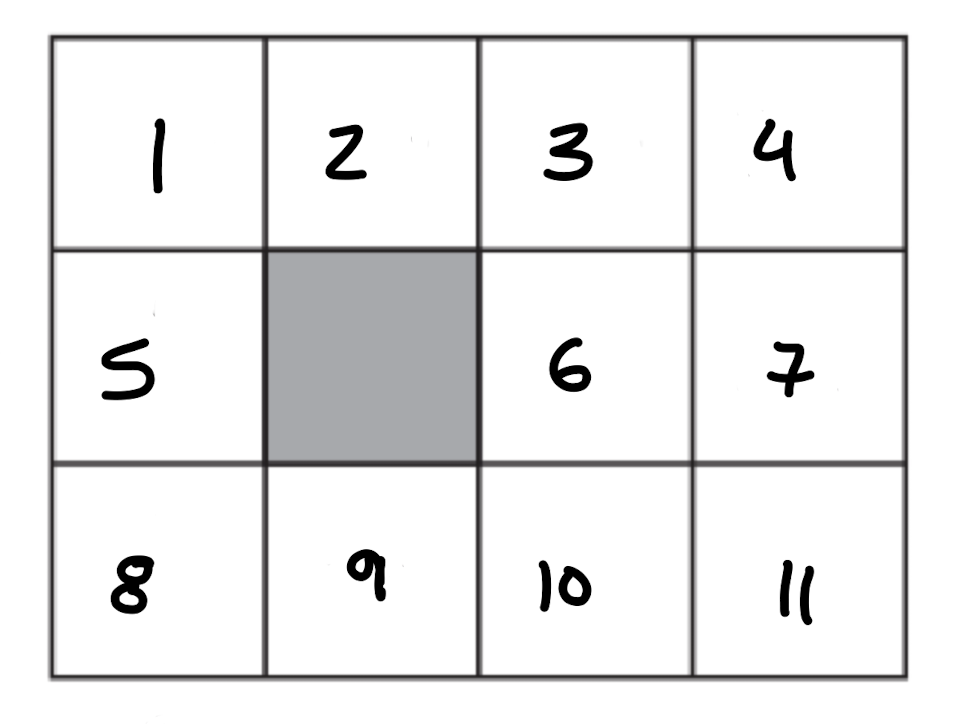
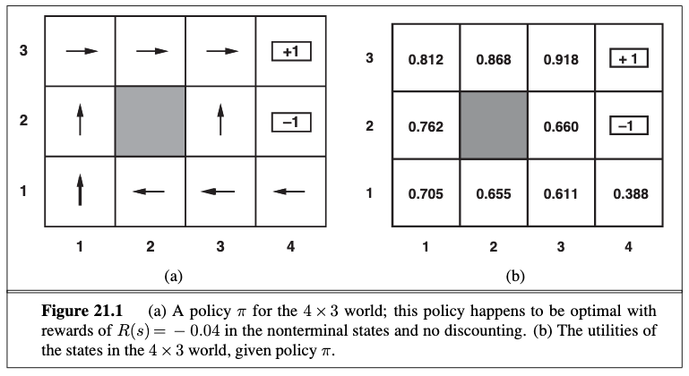

# Active Reinforcement Learning Example
## The Problem:
In chapter 21 of *Artificial Intelligence: A Modern Approch (Third Edition)*, Stuart Russell and Peter Norvig explain the application of Bayesian reinforcement learning with a policy iteration approach to solve a 4 by 3 'wompus world' problem by finding the optimal policy for each state in the grid.

And I wondered.... could I do that myself? Lets have a go!

The working grid defined in chapter 21 looks like the following, where each number represents a valid state and the dark square indicates a pit of some sort.



Additionally, states 4 and 7 are defined as terminal states with utilities of -1 and +1 respectively. State 4 indicates the goal state and state 7 represents the wompus.

Several hyper parameters along with each state's initial reward, terminal status, and state action probability (```state_n.txt```) is stored within the ```reinforcement_maze.txt``` file.
***
## The Solution:
### **I. Exploration/Learning Phase**
In order for our agent to calculate the optimal policy for the world, it must learn the true probabilities for each action its able to take from each state. 
It does this by compiling statistics about the world during its exploration phase.
By default my agent is naturally curious and at each state is exploring 60% of the time, meaning that 60% of the decisions it makes at each state during the exploration phase are a random choice of the available actions. 
The agent then tracks which actions have been taken and the outcomes of those decisions using the following equations:
*Note: In the exploration stage the learning agent never has the ability to see the true transition probabilities stored in the state files, it only has access to the previous iteration's statistics.*

A.

B.

### **II. Final Utility Calculation and Optimal Policy Generation**

After the exploration phase, the final utility for each state is calculated once again (with formula A) with probabilities that the agent has learned and the appropriate policy is written for each respective state.

From this calculation the optimal policies are determined for each state and we can visualize the output!

```
> python3 main.py 500 0.2
 
Exploring and Building statistics...
 
Optimal Policy: 
 
State 1 Utility: 0.803 Decision: Right
State 2 Utility: 0.862 Decision: Right
State 3 Utility: 0.915 Decision: Right
State 4 Utility: 1.000 Decision: None
State 5 Utility: 0.748 Decision: Up
State 6 Utility: 0.622 Decision: Up
State 7 Utility: -1.000 Decision: None
State 8 Utility: 0.685 Decision: Up
State 9 Utility: 0.616 Decision: Left
State 10 Utility: 0.563 Decision: Left
State 11 Utility: 0.398 Decision: Left
```

And contrasting these results with Figure 21.1 on page 832 we can see our results are very comparable!



***

# Usage
Below are the several ways you can run the experiment.

### **I. Run the script conventiionally with:**
1. ```pip install -r requirements.txt```
2. ```python3 main.py <NUM_ITERATIONS> <MAX_ERROR>```
	
### **II. Run using makefile:**
1. ```make compile```
2. ```make run``` or choose a specific scenario: ```make scenario-1``` or ```-2``` or ```-3```.


	
### **III. Run with docker:**
1. ```make docker-run```

	*Note: This will create an image and run a container with that image.*
	